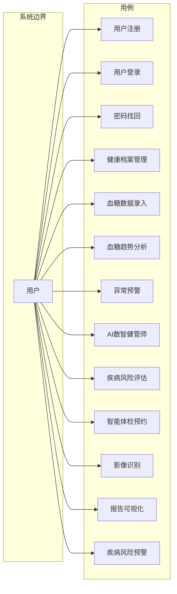
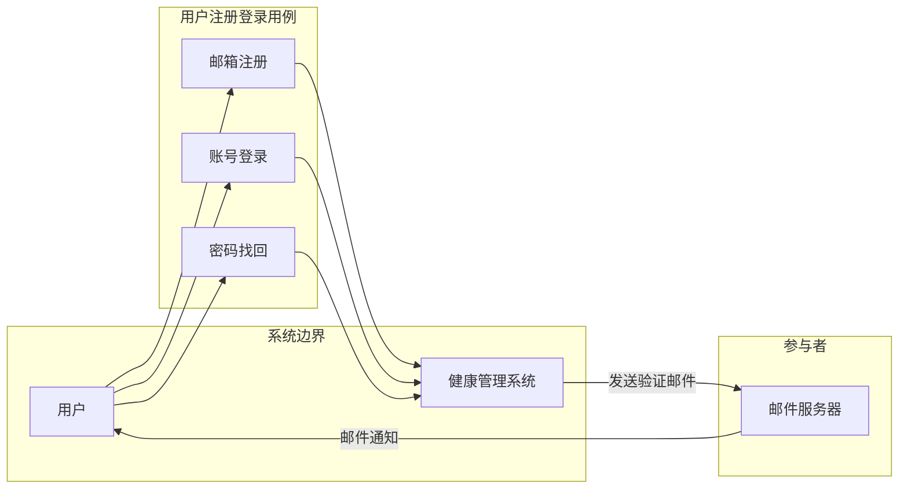
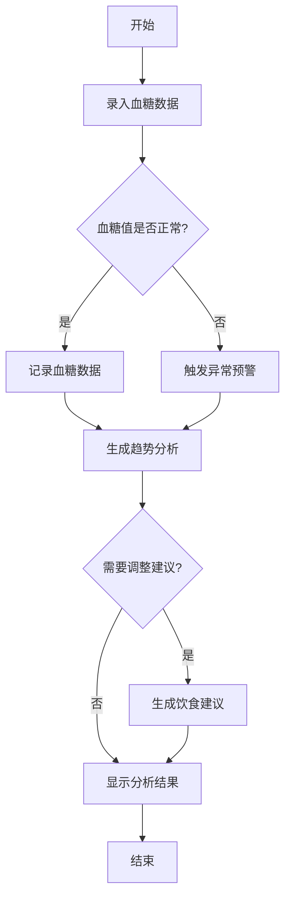
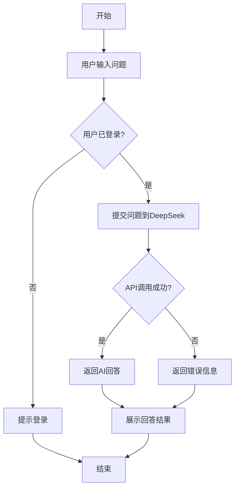
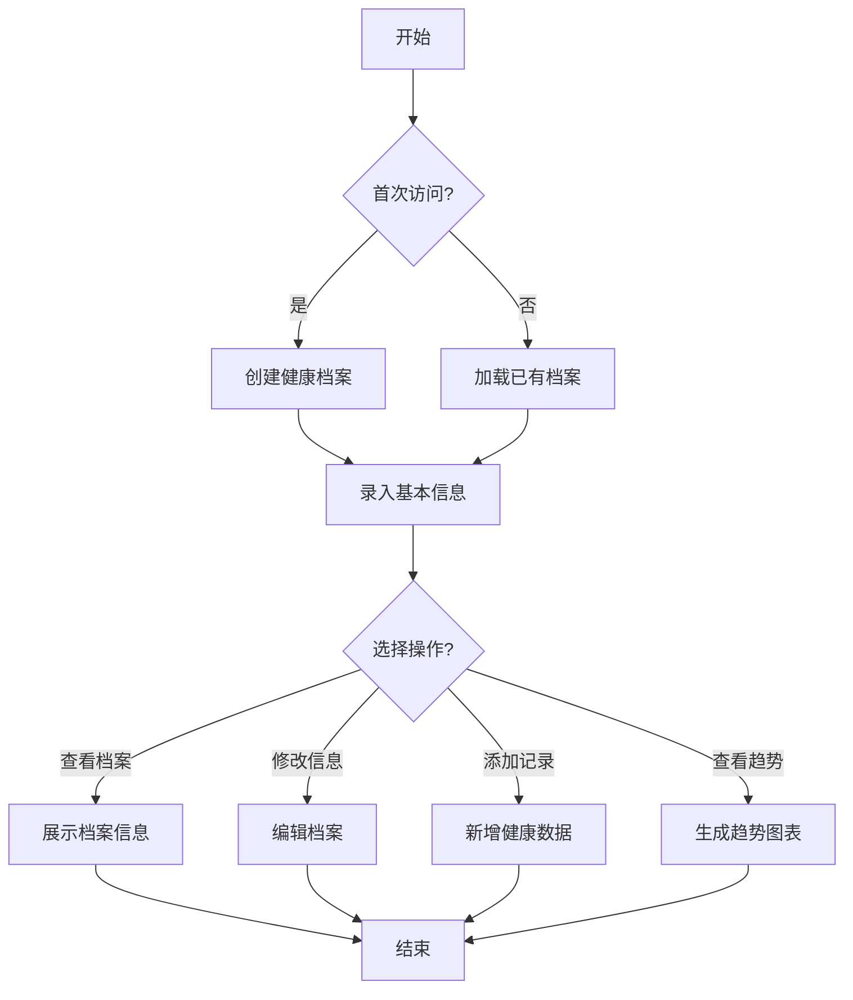
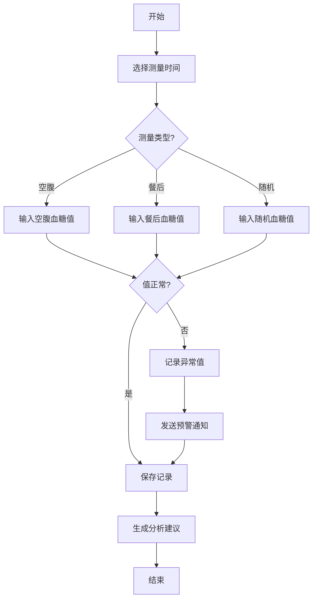
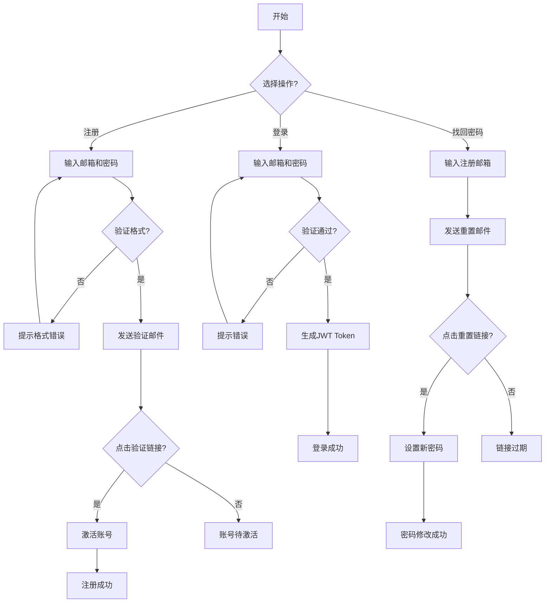
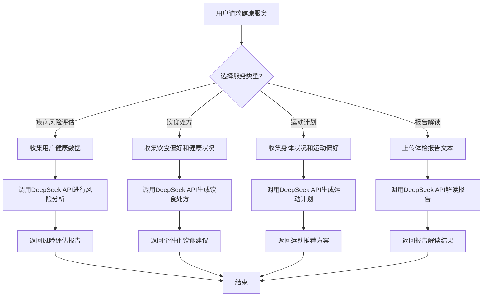
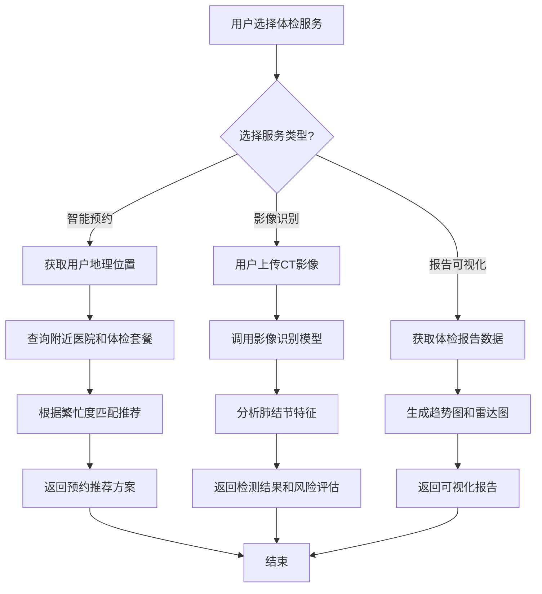
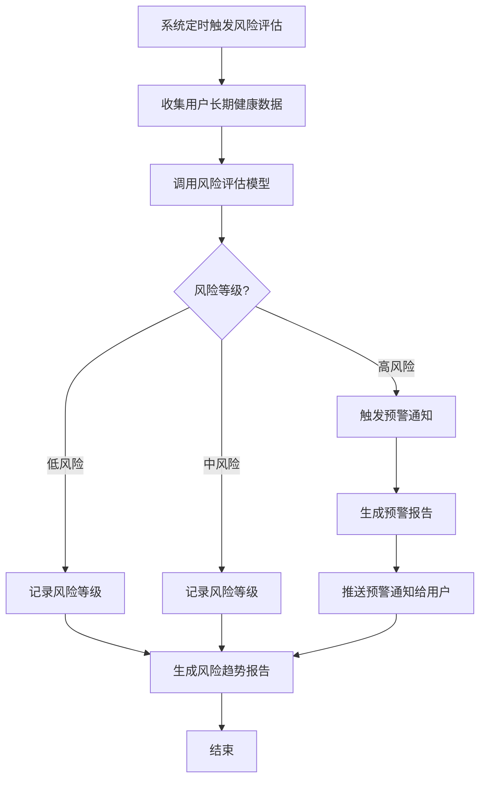

# 基于DeepSeek的全流程健康管理系统需求规格说明书

## 文档控制


| 项目   | 内容                   |
| ---- | -------------------- |
| 文档名称 | 需求规格说明书（SRS）         |
| 项目名称 | 基于DeepSeek的全流程健康管理系统 |
| 版本号  | V1.1                 |
| 创建日期 | 2026-06-01           |
| 文档状态 | 初稿                   |


---

## 一、引言

### 1.1 目的

本文档旨在完整、清晰、精确地描述基于DeepSeek的全流程健康管理系统的功能需求和非功能需求，作为系统开发、测试和验收的依据。

### 1.2 范围

本系统面向个人用户，提供以下核心服务：

- 用户注册登录
- 健康档案管理
- 血糖管理智能体
- AI健康咨询

### 1.3 定义与缩略语


| 术语       | 定义                       |
| -------- | ------------------------ |
| DeepSeek | 深度求索大语言模型                |
| JWT      | JSON Web Token，用于用户认证的令牌 |
| API      | 应用程序编程接口                 |


---

## 二、总体描述

### 2.1 产品前景

随着人们健康意识的提升和慢性病发病率的上升，智能化的健康管理工具成为刚需。本系统将DeepSeek大模型与健康数据结合，为用户提供便捷的血糖管理和健康咨询服务。

### 2.2 功能概述

系统提供六大核心功能：

1. **用户注册登录**：支持邮箱注册、账号登录、密码找回
2. **健康档案管理**：记录用户基本信息、健康数据
3. **血糖管理智能体**：血糖监测、趋势分析、异常预警
4. **AI数智健管师**：疾病风险评估、个性化饮食处方、运动计划推荐
5. **智能体检优化**：智能预约、影像识别、报告可视化
6. **疾病风险预警**：风险分级、高风险预警通知

### 2.3 用户特征


| 用户类型 | 特征描述       | 使用场景               |
| ---- | ---------- | ------------------ |
| 普通用户 | 有健康需求的个人用户 | 注册登录、管理健康数据、获取健康咨询 |
| 慢病患者 | 糖尿病、高血糖患者  | 血糖监测、趋势分析、预警提醒     |


### 2.4 系统架构

```
┌─────────────────────────────────────────────────────────────┐
│                        前端展示层（Vue.js）                    │
│   Web端                                                      │
├─────────────────────────────────────────────────────────────┤
│                        业务服务层（Java）                     │
│   用户服务 │ 健康管理服务 │ 血糖管理服务 │ 体检服务 │ 疾病预警服务 │
├─────────────────────────────────────────────────────────────┤
│                        AI能力层                              │
│   DeepSeek API │ 影像识别模型 │ 风险评估模型                    │
├─────────────────────────────────────────────────────────────┤
│                        数据层（MySQL）                        │
│   用户数据 │ 健康档案 │ 血糖记录 │ 体检数据 │ 风险评估数据        │
└─────────────────────────────────────────────────────────────┘
```

---

## 三、UML建模

### 3.1 系统用例图




### 3.2 用户注册登录用例图




### 3.3 血糖管理活动图




### 3.4 AI健康咨询活动图




### 3.5 健康档案管理活动图




### 3.6 血糖录入子活动图




---

## 四、功能需求

### 4.1 用户注册登录（F001）

#### 4.1.1 功能描述

支持用户通过邮箱进行注册、登录和密码找回。

#### 4.1.2 功能用例


| 用例ID  | 用例名称 | 用例描述                           |
| ----- | ---- | ------------------------------ |
| UC001 | 邮箱注册 | 用户输入邮箱地址和密码完成注册，系统发送验证邮件       |
| UC002 | 账号登录 | 用户输入邮箱和密码登录系统，登录成功后生成JWT token |
| UC003 | 密码找回 | 用户输入注册邮箱，系统发送重置链接，用户设置新密码      |


#### 4.1.3 业务流程




#### 4.1.4 输入输出

**注册输入：**

- 邮箱地址（必填，格式校验）
- 密码（必填，8-20位，含大小写字母和数字）

**登录输入：**

- 邮箱地址（必填）
- 密码（必填）

**密码找回输入：**

- 注册邮箱（必填）

---

### 4.2 健康档案管理（F002）

#### 4.2.1 功能描述

管理用户的健康档案，包括基本信息、既往病史、过敏信息等。

#### 4.2.2 功能用例


| 用例ID  | 用例名称   | 用例描述           |
| ----- | ------ | -------------- |
| UC004 | 创建档案   | 首次用户创建个人健康档案   |
| UC005 | 查看档案   | 用户查看自己的健康档案信息  |
| UC006 | 编辑档案   | 用户修改健康档案中的信息   |
| UC007 | 添加健康数据 | 用户录入血压、体重等健康指标 |


#### 4.2.3 数据模型

**用户健康档案**


| 字段              | 类型       | 说明     |
| --------------- | -------- | ------ |
| user_id         | Long     | 用户唯一标识 |
| email           | String   | 邮箱     |
| username        | String   | 用户名    |
| gender          | String   | 性别     |
| birth_date      | Date     | 出生日期   |
| height          | Double   | 身高(cm) |
| weight          | Double   | 体重(kg) |
| blood_type      | String   | 血型     |
| allergies       | String   | 过敏史    |
| family_history  | String   | 家族病史   |
| medical_history | String   | 既往病史   |
| created_at      | DateTime | 创建时间   |
| updated_at      | DateTime | 更新时间   |


---

### 4.3 血糖管理智能体（F003）

#### 4.3.1 功能描述

血糖管理智能体通过对用户血糖数据的分析，提供个性化的健康管理服务。

#### 4.3.2 功能用例


| 用例ID  | 用例名称   | 用例描述                  |
| ----- | ------ | --------------------- |
| UC008 | 血糖数据录入 | 用户手动录入血糖测量值（空腹/餐后/随机） |
| UC009 | 血糖趋势分析 | 系统生成血糖变化曲线图，识别波动规律    |
| UC010 | 饮食建议生成 | 基于血糖数据，生成个性化饮食调整方案    |
| UC011 | 异常预警   | 当血糖值超出安全范围时，发送预警通知    |


#### 4.3.3 输入输出

**输入：**

- 血糖测量值（mmol/L）
- 测量时间（空腹/餐后1h/餐后2h/随机）
- 测量日期和时间

**输出：**

- 血糖趋势报告（折线图）
- 个性化饮食建议
- 异常预警信息

#### 4.3.4 血糖参考范围


| 类型     | 正常范围           | 异常提示                         |
| ------ | -------------- | ---------------------------- |
| 空腹血糖   | 3.9-6.1 mmol/L | < 3.9 低血糖，> 6.1 偏高，> 7.0 需就医 |
| 餐后2h血糖 | < 7.8 mmol/L   | 7.8-11.1 糖耐量异常，> 11.1 需就医    |


---

### 4.4 AI数智健管师（F004）

#### 4.4.1 功能描述

基于DeepSeek大模型，综合用户家族病史、体检数据、生活习惯等多维度信息，提供疾病风险评估、个性化饮食处方和运动计划推荐服务。

#### 4.4.2 功能用例


| 用例ID  | 用例名称 | 用例描述                     |
| ----- | ---- | ------------------------ |
| UC012 | 疾病风险评估 | 综合用户多维度健康数据，评估疾病风险等级 |
| UC013 | 饮食处方生成 | 根据用户健康状况和饮食偏好，生成个性化营养搭配建议 |
| UC014 | 运动计划推荐 | 根据用户身体状况，推荐适合的运动类型和强度 |
| UC015 | 健康报告解读 | 用户上传体检报告文本，获取AI解读和建议 |


#### 4.4.3 输入输出

**输入：**
- 用户健康数据（血糖、血压、体重等）
- 家族病史信息
- 体检报告文本
- 饮食偏好和运动习惯

**输出：**
- 疾病风险评估报告（风险等级 + 风险因素）
- 个性化饮食处方（热量控制、营养素配比、食材推荐）
- 运动计划推荐（运动类型、强度、频次）
- 健康报告解读（指标含义 + 健康建议）

#### 4.4.4 业务流程




---

### 4.5 智能体检优化（F005）

#### 4.5.1 功能描述

提供智能体检预约、影像识别和报告可视化服务，帮助用户高效完成体检并理解体检结果。

#### 4.5.2 功能用例


| 用例ID  | 用例名称 | 用例描述                     |
| ----- | ---- | ------------------------ |
| UC016 | 智能体检预约 | 根据用户地理位置和医院繁忙度，推荐最优体检预约方案 |
| UC017 | 肺结节检测 | 对用户上传的胸部CT影像进行肺结节检测和风险评估 |
| UC018 | 报告可视化 | 将体检报告各项指标以趋势图、雷达图等形式可视化展示 |


#### 4.5.3 输入输出

**输入：**
- 用户地理位置信息
- 体检影像（胸部CT等）
- 体检报告数据

**输出：**
- 智能预约推荐方案（医院+时间+套餐）
- 影像识别结果（肺结节位置、大小、风险等级）
- 可视化报告（指标趋势图、雷达图、对比分析）


#### 4.5.4 业务流程




---

### 4.6 疾病风险预警（F006）

#### 4.6.1 功能描述

基于用户长期健康数据，采用多维度指标建模进行疾病风险分级，并对高风险用户进行预警通知。

#### 4.6.2 功能用例


| 用例ID  | 用例名称 | 用例描述                     |
| ----- | ---- | ------------------------ |
| UC019 | 风险分级评估 | 基于长期健康数据，将用户风险划分为低/中/高三级 |
| UC020 | 高风险预警 | 当用户健康指标持续异常或风险等级升高时，推送预警通知 |
| UC021 | 风险趋势追踪 | 记录用户风险等级变化趋势，支持历史对比分析 |


#### 4.6.3 输入输出

**输入：**
- 用户长期健康数据（血糖、血压、体重等历史记录）
- 用户基本信息（年龄、性别、家族病史）

**输出：**
- 风险分级结果（低/中/高风险）
- 预警通知（异常指标 + 风险说明 + 建议措施）
- 风险趋势报告（历史变化曲线）


#### 4.6.4 业务流程




---

## 五、非功能需求

### 5.1 性能需求


| 指标     | 要求                        |
| ------ | ------------------------- |
| 系统响应时间 | 核心页面加载 < 2秒，API调用 < 500ms |
| 并发支持   | 支持1000用户并发访问              |
| 可用性    | 系统可用性达到99.5%              |


### 5.2 安全需求


| 需求类别 | 具体要求                     |
| ---- | ------------------------ |
| 数据加密 | 传输使用HTTPS，密码使用BCrypt加密存储 |
| 访问控制 | 基于JWT token的认证机制         |
| 审计日志 | 记录关键操作的日志                |


### 5.3 可靠性需求


| 指标   | 要求          |
| ---- | ----------- |
| 故障恢复 | 系统故障后1小时内恢复 |
| 数据备份 | 每日增量备份      |


---

## 六、接口需求

### 6.1 外部接口

本项目仅接入以下第三方服务：


| 服务           | 接口类型    | 用途         |
| ------------ | ------- | ---------- |
| DeepSeek API | RESTful | AI智能问答能力调用 |


### 6.2 内部接口


| 模块     | 接口描述         |
| ------ | ------------ |
| 用户模块   | 注册、登录、密码找回   |
| 健康档案模块 | 档案CRUD操作     |
| 血糖模块   | 血糖数据录入、查询、分析 |
| AI数智健管师模块 | 疾病风险评估、饮食处方、运动计划、报告解读 |
| 体检模块   | 智能预约、影像识别、报告可视化 |
| 疾病预警模块 | 风险分级、预警通知、趋势追踪 |


---

## 七、验收标准

### 7.1 功能验收


| 功能模块 | 验收标准                  |
| ---- | --------------------- |
| 用户注册 | 邮箱格式正确，密码强度达标，邮件发送成功  |
| 用户登录 | 凭正确凭据登录成功，生成有效Token   |
| 健康档案 | 能正确创建、查看、编辑档案信息       |
| 血糖管理 | 能录入血糖数据，生成趋势图         |
| AI数智健管师 | 能进行疾病风险评估，生成饮食处方和运动计划 |
| 智能体检 | 能智能推荐预约方案，识别肺结节，生成可视化报告 |
| 疾病预警 | 能进行风险分级，推送高风险预警通知     |


### 7.2 性能验收


| 指标   | 验收标准          |
| ---- | ------------- |
| 响应时间 | 核心功能页面加载 < 2秒 |
| 并发测试 | 100并发用户无异常    |


---

## 八、项目里程碑（3周）


| 阶段   | 时间   | 主要交付物         |
| ---- | ---- | ------------- |
| 基础功能 | 第1周  | 用户注册登录、健康档案管理 |
| 核心功能 | 第2周  | 血糖管理智能体、AI数智健管师、疾病风险预警 |
| AI集成 | 第3周  | 智能体检优化、集成测试、部署上线 |


---

*文档结束*